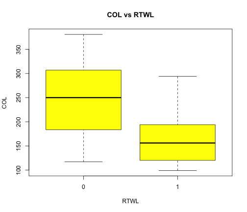
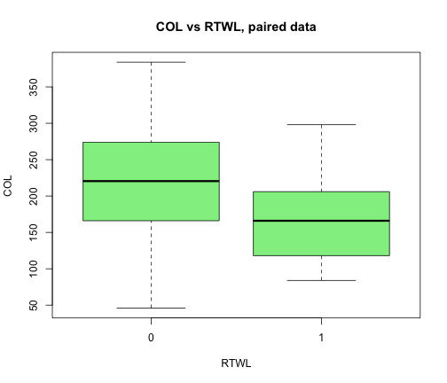
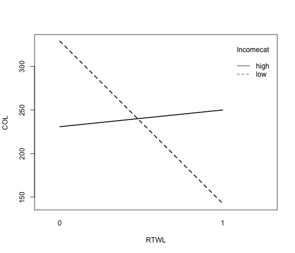

Psych 252: R Tutorial Module 2
========================================================

Based on notes by Paul Thibodeau (2009) and revisions by the Psych 252 instructors in 2010 and 2011

Expanded in 2012 by Mike Frank, Benoit Monin and Ewart Thomas

Converted to [R Markdown](http://www.rstudio.com/ide/docs/r_markdown) format and further expanded in 2013 by Stephanie Gagnon.

2013 TAs: Stephanie Gagnon, Lauren Howe, Michael Waskom, Alyssa Fu, Kevin Mickey, Eric Miller


Manipulating Dataframes
-----------------------

To begin, we'll load in a simple data file that we'll use in 252, and store it as a [dataframe](http://www.r-tutor.com/r-introduction/data-frame) named "d2".


```r
d2 = read.csv("fieldsimul1.csv")
```


Let's explore this data a bit to see what we'll be working with:


```r
str(d2)
```

```
## 'data.frame':	200 obs. of  7 variables:
##  $ recall : int  1 1 1 1 1 1 1 1 1 1 ...
##  $ prop54 : int  1 1 1 1 1 1 1 1 1 1 ...
##  $ party  : int  1 1 1 1 1 1 1 1 1 1 ...
##  $ age    : int  49 44 46 50 25 28 21 20 22 73 ...
##  $ optmism: int  7 8 7 7 6 7 5 5 6 8 ...
##  $ agecat : int  45 45 45 45 24 24 24 24 24 70 ...
##  $ recallq: int  1 1 1 1 1 1 1 1 1 1 ...
```

```r
head(d2)
```

```
##   recall prop54 party age optmism agecat recallq
## 1      1      1     1  49       7     45       1
## 2      1      1     1  44       8     45       1
## 3      1      1     1  46       7     45       1
## 4      1      1     1  50       7     45       1
## 5      1      1     1  25       6     24       1
## 6      1      1     1  28       7     24       1
```

```r
summary(d2)
```

```
##      recall         prop54         party           age      
##  Min.   :1.00   Min.   :1.00   Min.   :1.00   Min.   :20.0  
##  1st Qu.:1.00   1st Qu.:1.00   1st Qu.:1.00   1st Qu.:37.0  
##  Median :1.00   Median :2.00   Median :2.00   Median :48.0  
##  Mean   :1.51   Mean   :1.78   Mean   :1.75   Mean   :48.3  
##  3rd Qu.:2.00   3rd Qu.:2.00   3rd Qu.:2.00   3rd Qu.:58.0  
##  Max.   :3.00   Max.   :3.00   Max.   :3.00   Max.   :75.0  
##     optmism          agecat        recallq      
##  Min.   : 0.00   Min.   :24.0   Min.   :-1.000  
##  1st Qu.: 4.00   1st Qu.:35.0   1st Qu.:-1.000  
##  Median : 6.00   Median :45.0   Median : 1.000  
##  Mean   : 5.62   Mean   :48.1   Mean   : 0.115  
##  3rd Qu.: 7.00   3rd Qu.:57.0   3rd Qu.: 1.000  
##  Max.   :11.00   Max.   :70.0   Max.   : 1.000
```


Here we can see that this **dataframe** is composed of 7 **variables** that each has 200 observations. In this case, each observation represents a different participant, and the 7 variables tell us information about that participant. As an example, let's look at all the information for participant 5 by looking at the 5th row of d2:


```r
participant_num = 5
d2[participant_num, ]
```

```
##   recall prop54 party age optmism agecat recallq
## 5      1      1     1  25       6     24       1
```


This shows us that participant 5 is 25 years old, and has an optimism score of 6.


Integer vs. Factor
------------------

Now, we might want to treat some variables as qualitative, nominal **factors** rather than continuous, numeric **integers**. In R, we must specify which variables to treat as factors if the **levels** (i.e., unique values) of the variable are composed of numbers instead of strings. Note that if the variable (e.g., "Subid") *levels* start with a letter (e.g., "subject1", "subject2") R will automatically interpret the variable as a *factor*. If the variable levels start with a number (e.g., "1", "2"), R with automatically interpret the variable as an *integer*. If you want the variable interpreted differently, you have to tell R.

For instance, the variable "age" is continuous, but "agecat" is not. However, since the **levels** of "agecat" are indicated with numbers, we must tell R to treat "agecat" as a factor:


```r
d2$agecat = factor(d2$agecat)
```


Now we can look at the structure of the d2 dataframe again, to make sure agecat is now a factor:


```r
str(d2)
```

```
## 'data.frame':	200 obs. of  7 variables:
##  $ recall : int  1 1 1 1 1 1 1 1 1 1 ...
##  $ prop54 : int  1 1 1 1 1 1 1 1 1 1 ...
##  $ party  : int  1 1 1 1 1 1 1 1 1 1 ...
##  $ age    : int  49 44 46 50 25 28 21 20 22 73 ...
##  $ optmism: int  7 8 7 7 6 7 5 5 6 8 ...
##  $ agecat : Factor w/ 5 levels "24","35","45",..: 3 3 3 3 1 1 1 1 1 5 ...
##  $ recallq: int  1 1 1 1 1 1 1 1 1 1 ...
```


We can also plot age as a function of age category. Here we'll tell R to make the plot **with** the d2 dataframe. This saves on typing "d2$" in front of each variable name.

```r
with(d2, plot(age ~ agecat))
```

 

```r
# with(d2,plot(agecat, age)) # these 2 lines do the same thing!
```


Note, you can run plot in the format **plot(Y ~ X)**, as well as **plot(X, Y)**. These will produce the same plot.


Creating factors from continuous variables
------------------------------------------

Suppose the variable "agecat" wasn't given to us, but we still wanted to group participants into categories based on their respective ages. Given the "age" variable, we can create a new categorical variable (i.e., **factor**) by specifying breaks at specific intervals:


```r
d2$agecat0 = findInterval(d2$age, c(29, 39, 49, 65))
d2$agecat0 = factor(d2$agecat0)
head(d2)
```

```
##   recall prop54 party age optmism agecat recallq agecat0
## 1      1      1     1  49       7     45       1       3
## 2      1      1     1  44       8     45       1       2
## 3      1      1     1  46       7     45       1       2
## 4      1      1     1  50       7     45       1       3
## 5      1      1     1  25       6     24       1       0
## 6      1      1     1  28       7     24       1       0
```


Specifically, these break points result in 5 age categories, 0:28, 29:38, 39:48, 49:64, and 64 and up. We can also visualize these groups:


```r
with(d2, plot(age ~ agecat0))
```

 


Basic Plotting
--------------

Now that we have our data, we can use plots to visualize things like the distribution of certain variables. Let's start out by plotting a histogram of the ages. We can set the color of the bars with the option "col", and set the main title with the option "main":


```r
hist(d2$age, col = "orange", main = "Distribution of age")
```

 


Next, let's view a scatter plot of optimism by age. Before when we used the plot() function, we were plotting a **factor** variable on the x-axis. As a result, R generated boxplots. However, if the x-axis variable is **continuous** (i.e., numeric), plot() will generate a scatterplot.

We'll also add in a line to get a sense of the general trend of the data; here, we'll plot a non-parametric best-filling curve in red using the ["lowess"](http://rss.acs.unt.edu/Rdoc/library/gplots/html/lowess.html) function.


```r
plot(d2$age, d2$optmism, main = "Optimism vs Age")
lines(lowess(d2$age, d2$optmism), lty = 2, col = "red")
```

 


Linear Regression
------------------

To examine the best-fitting linear relationship between quantiative variables (e.g., X and Y), we can use the function [lm()](http://www.statmethods.net/stats/regression.html). **lm()** is useful in fitting linear models. To use **lm()** you must provide a fomula, like **Y ~ X**. In this case, X is your independent variable (IV), and Y is your dependent variable (DV). That is, as X changes, what happens to Y? How much of the variance in Y is explained by variance in X?

For instance, we might want to investigate the relationship between age (X) and optimism (Y), depicted in the plot above. As age increases, how does optimism change?


```r
rs2 = lm(optmism ~ age, data = d2)  # this is the same as lm(d2$optmism ~ d2$age)
print(summary(rs2))  # given the model we just fit with lm(), give us the summary
```

```
## 
## Call:
## lm(formula = optmism ~ age, data = d2)
## 
## Residuals:
##    Min     1Q Median     3Q    Max 
## -4.813 -1.130  0.074  1.193  5.793 
## 
## Coefficients:
##             Estimate Std. Error t value Pr(>|t|)    
## (Intercept)  3.49888    0.44360    7.89  2.0e-13 ***
## age          0.04379    0.00879    4.98  1.4e-06 ***
## ---
## Signif. codes:  0 '***' 0.001 '**' 0.01 '*' 0.05 '.' 0.1 ' ' 1 
## 
## Residual standard error: 1.82 on 198 degrees of freedom
## Multiple R-squared: 0.111,	Adjusted R-squared: 0.107 
## F-statistic: 24.8 on 1 and 198 DF,  p-value: 1.36e-06
```


Based off of this output, we can see that age is a significant predictor of optimism; the variance in age explains approximately 10% of the variance in optimism.

We can also plot the regression line, fit by least squares regression, on top of the scatterplot. Here, we use the function **abline()**, and give it the model we just fit above with lm(). While we're doing this, let's also change the names of the x- and y-axis labels:

```r
plot(d2$optmism ~ d2$age, main = "Optimism vs Age", xlab = "Age", ylab = "Optimism")
abline(rs2, col = "red")
```

 


We can also visualize diagnostic plots of the residuals from the lm() output, which  can be helpful in showing if assumptions of normality, etc, are met, or to identify outliers:

```r
plot(rs2)
```

    


Reading data from online repositories
--------------------------------------

R allows us to read data that's stored a file on your computer or from a URL online. We can provide the website URL, and R will read in the table:


```r
flu.table <- read.table("http://www-stat.stanford.edu/~jtaylo/courses/stats191/data/flu.table", 
    header = TRUE)

str(flu.table)  # description of dataframe
```

```
## 'data.frame':	50 obs. of  3 variables:
##  $ Shot        : num  0 1 0 1 1 0 1 0 0 1 ...
##  $ Age         : num  38 52 41 46 41 43 57 34 31 49 ...
##  $ Health.Aware: num  40 60 36 59 70 49 59 50 48 59 ...
```


Note that when you're reading in a **table**, you have to tell R that you want the first row in the file to be the header (i.e., the names of the variables) with the option "header=TRUE". If you have a **csv** R will treat the first row as a header by default.

Here, we have a numeric matrix of data, with 50 observations for 3 variables. To get an idea of the pairwise relationships between all these variables, we can visualize all these plots with the pairs() function:


```r
pairs(flu.table, cex.labels = 2, pch = 23, bg = "orange", cex = 2)
```

 


It looks like the probability of receiving a shot might be related to the amount of health awareness. Let's view a scatterplot of just these two variables, and overlay a red non-parametric best-fitting curve showing how the Probability(Shot = 1) varies with health awareness:

```r
plot(flu.table$Health.Aware, flu.table$Shot, main = "Prob(Shot) vs Awareness", 
    xlab = "Health Awareness", ylab = "Shot Probability")
lines(lowess(flu.table$Health.Aware, flu.table$Shot), lty = 2, col = "red")  #
```

 


More example data
-----------------

What is the effect of a right-to-work law (RTWL = 0 or 1) on the cost-of-living (COL) of an 'average' family, controlling for unionization rate, population, popn density, property taxes, per capita income? Data from 38 cities. (RTWL's, e.g., Taft-Hartley Amendments (1947), tended to reduce the power of unions over workers; did they make life easier or harder for workers?)


```r
rtw.table <- read.table("http://www.ilr.cornell.edu/~hadi/RABE4/Data4/P005.txt", 
    header = T, sep = "\t")  # the separation between columns is a tab (\t), instead of a comma, etc.

str(rtw.table)
```

```
## 'data.frame':	38 obs. of  8 variables:
##  $ City  : Factor w/ 38 levels "Atlanta","Austin",..: 1 2 3 4 5 6 7 9 8 10 ...
##  $ COL   : int  169 143 339 173 99 363 253 117 294 291 ...
##  $ PD    : int  414 239 43 951 255 1257 834 162 229 1886 ...
##  $ URate : num  13.6 11 23.7 21 16 24.4 39.2 31.5 18.2 31.5 ...
##  $ Pop   : int  1790128 396891 349874 2147850 411725 3914071 1326848 162304 164145 7015251 ...
##  $ Taxes : int  5128 4303 4166 5001 3965 4928 4471 4813 4839 5408 ...
##  $ Income: int  2961 1711 2122 4654 1620 5634 7213 5535 7224 6113 ...
##  $ RTWL  : int  1 1 0 0 1 0 0 0 1 0 ...
```


Let's plot a boxplot of the cost of living (COL) by whether or not there is a right-to-work law in place:

```r
boxplot(rtw.table$COL ~ rtw.table$RTWL, col = "orange", pch = 23, bg = "red", 
    main = "COL vs RTWL")  # any relation between COL and RTWL?
```

 


Attaching Dataframes
--------------------

Sometimes it can get annoying typing in the name of the dataframe each time you want to specify a variable. If you're going to be working with one dataframe for a while, it can be helpful to **attach** the dataframe while you're working, and then **detach** it when you're done. When a dataframe is attached, you can just type in the name of the variable, and R will know to look in the attached dataframe.


```r
attach(rtw.table)

plot(URate, COL, pch = 23, bg = "red", main = "COL vs URate")
lines(lowess(URate, COL), lty = 2, col = "red")  # a non-parametric best-fitting curve
```

 


Make sure you remember to detach the dataframe when you're done, otherwise R can get confused if you work with a different dataframe with similar variables!

```r
detach(rtw.table)
```


Regression: simple and multiple
-------------------------------

Now let's re-attach the rtw.table dataframe, and examine the relationship between unemployment rate ('Urate') and cost of living ('COL') using the lm() function.


```r
attach(rtw.table)

rs3 = lm(COL ~ URate)  # Simple regression of one quantitative variable on another
summary(rs3)
```

```
## 
## Call:
## lm(formula = COL ~ URate)
## 
## Residuals:
##     Min      1Q  Median      3Q     Max 
## -124.04  -53.40   -2.23   44.77  158.61 
## 
## Coefficients:
##             Estimate Std. Error t value Pr(>|t|)    
## (Intercept)   165.72      36.65    4.52  6.4e-05 ***
## URate           2.39       1.43    1.67      0.1    
## ---
## Signif. codes:  0 '***' 0.001 '**' 0.01 '*' 0.05 '.' 0.1 ' ' 1 
## 
## Residual standard error: 74.7 on 36 degrees of freedom
## Multiple R-squared: 0.0722,	Adjusted R-squared: 0.0465 
## F-statistic:  2.8 on 1 and 36 DF,  p-value: 0.103
```

Here, the output suggests that there is not a significant relationship between unemployment rate and cost of living. We can see this by looking under the "Coefficients", for URate t=1.67, p = 0.103. In the text at the bottom, F(1,36)=2.803, p=0.1028.

We can also plot the residuals to get a better idea of possible outliers, etc.

```r
plot(rs3)
```

    


### Removing outliers
These last diagnostic plots suggest that observations 6 and 34 are outliers. What would the plot look like if these outliers were removed? To do this, we can give R a **negative vector** by typing "-c(6, 34)", and then we can tell R to take all the values *minus* the values in the vector from the variable. By saying **URate[-c(6,34)]** we're telling R to take all the rows in Urate with the exception of 6 and 34.


```r
plot(URate[-c(6, 34)], COL[-c(6, 34)], pch = 23, bg = "red", main = "COL vs URate")
lines(lowess(URate[-c(6, 34)], COL[-c(6, 34)]), lty = 2, col = "red")  # a non-parametric best-fitting curve
```

 


```r
rs4 = lm(COL[-c(6, 34)] ~ URate[-c(6, 34)])  # Simple regression of one quantitative variable on another
print(summary(rs4))
```

```
## 
## Call:
## lm(formula = COL[-c(6, 34)] ~ URate[-c(6, 34)])
## 
## Residuals:
##     Min      1Q  Median      3Q     Max 
## -115.93  -45.63   -0.55   43.72  125.89 
## 
## Coefficients:
##                  Estimate Std. Error t value Pr(>|t|)    
## (Intercept)        156.92      33.13    4.74  3.8e-05 ***
## URate[-c(6, 34)]     2.41       1.29    1.88    0.069 .  
## ---
## Signif. codes:  0 '***' 0.001 '**' 0.01 '*' 0.05 '.' 0.1 ' ' 1 
## 
## Residual standard error: 67.3 on 34 degrees of freedom
## Multiple R-squared: 0.0938,	Adjusted R-squared: 0.0671 
## F-statistic: 3.52 on 1 and 34 DF,  p-value: 0.0693
```


Here we can see that there is not much difference in the lowess curve, but when those outliers were removed, the effect of unemployment rate on cost of living is marginally significant.

### Multivariate analysis

Sometimes we want to know how **multiple** variables influence our DV. Using lm() we can provide multiple IVs using the format lm(Y ~ X1 + X2 + X3). We'll cover this in class soon, but basically this model will tell us the *unique* variance in Y that is explained by each IV, *when controlling for the other variables*. 

Now, one might ask if the right to work law affects cost of living, when controlling for other variables, such as income. This is an example of multivariate analysis. To examine this question, we can enter multiple predictors into the lm() function:


```r
rs4 = lm(COL ~ RTWL + URate + Income + PD)
summary(rs4)
```

```
## 
## Call:
## lm(formula = COL ~ RTWL + URate + Income + PD)
## 
## Residuals:
##     Min      1Q  Median      3Q     Max 
## -104.00  -41.03   -4.42   31.52  126.00 
## 
## Coefficients:
##              Estimate Std. Error t value Pr(>|t|)    
## (Intercept)  3.24e+02   6.01e+01    5.38  5.9e-06 ***
## RTWL        -1.22e+02   3.86e+01   -3.16   0.0034 ** 
## URate       -5.20e+00   2.19e+00   -2.37   0.0238 *  
## Income       7.52e-03   6.02e-03    1.25   0.2204    
## PD           2.88e-02   1.04e-02    2.78   0.0089 ** 
## ---
## Signif. codes:  0 '***' 0.001 '**' 0.01 '*' 0.05 '.' 0.1 ' ' 1 
## 
## Residual standard error: 62.7 on 33 degrees of freedom
## Multiple R-squared: 0.402,	Adjusted R-squared: 0.329 
## F-statistic: 5.54 on 4 and 33 DF,  p-value: 0.0016
```

Here we can see that the right to work law affects cost of living when controlling for the other factors. The presence of a right to work low corresponds with a lower cost of living. Further, when controlling for Income, PD, and the right to work law, unemployment rate also explains a signficant amount of unique variance in cost of living; more specifically, as unemployment rate increases, cost of living decreases.


Remember to detach the dataframe when you're done working!

```r
detach(rtw.table)
```


Plotting Data from Repeated Measures Designs: An intro to ggplot2 & reshape2
----------------------------------------------------------------------------

[ggplot2](http://ggplot2.org/) is a plotting library for R. It is an easy way to create beautiful plots. There are a *ton* of different options, so feel free to explore these w/Google as a guide. [Here](http://www.cookbook-r.com/Graphs/) is just one of many helpful websites.

### Installing packages
R has a lot of great [packages](http://cran.r-project.org/web/packages/available_packages_by_name.html) contributed by other people who use R. These packages can be really helpful, especially for plotting, and running more complicated analyses.

Let's install a couple useful packages, including **ggplot2** and **reshape2**. [Reshape2](http://stats.stackexchange.com/questions/7439/how-to-change-data-between-wide-and-long-formats-in-r) will allow us to reshape dataframes, e.g., going from short-form (where each participant is in 1 row, with multiple columns for different measurements) to long-form (where each observation is in a different row). 

```r
install.packages("ggplot2")
```

```
## Installing package(s) into
## '/Applications/RStudio.app/Contents/Resources/R/library' (as 'lib' is
## unspecified)
```

```
## Error: trying to use CRAN without setting a mirror
```

```r
install.packages("reshape2")
```

```
## Installing package(s) into
## '/Applications/RStudio.app/Contents/Resources/R/library' (as 'lib' is
## unspecified)
```

```
## Error: trying to use CRAN without setting a mirror
```

If you have trouble with the CRAN mirror, you might need to install using the GUI, by clicking on Tools, and then Install Packages. 

### Loading packages
You only need to install these packages once, but you'll need to load them in everytime you start R using the library() function:

```r
library(ggplot2)
```

```
## Warning: package 'ggplot2' was built under R version 2.15.2
```

```r
library(reshape2)
```


### Reshaping dataframes
Let's load in some data that has both *between*- and *within*-subject factors. Here attention ('attnr') is a between-subject factor, where subjects were placed into either a "divided" or "focused" attention group. Number ('num') is a within-subject factor, where each subject completed all three levels (num1, num2, num3). Subjects ('subidr') is a random effects factor.

```r
d <- read.csv("kv0.csv")
head(d)
```

```
##   subidr   attnr num1 num2 num3
## 1      1 divided    2    4    7
## 2      2 divided    3    4    5
## 3      3 divided    3    5    6
## 4      4 divided    5    7    5
## 5      5 divided    4    5    8
## 6      6 divided    5    5    6
```

```r
str(d)
```

```
## 'data.frame':	20 obs. of  5 variables:
##  $ subidr: int  1 2 3 4 5 6 7 8 9 10 ...
##  $ attnr : Factor w/ 2 levels "divided","focused": 1 1 1 1 1 1 1 1 1 1 ...
##  $ num1  : int  2 3 3 5 4 5 5 5 2 6 ...
##  $ num2  : num  4 4 5 7 5 5 4.5 7 3 5 ...
##  $ num3  : int  7 5 6 5 8 6 6 8 7 6 ...
```


As you can see, this dataframe is in short-form, meaning that the within-subject observations are displayed in separate columns, and each subject occupies a single row. 

To convert this dataframe to long-form, we can use the melt() function from the reshape2 package. Our 'id.vars' are those variables that we want to be the same for each subject, and the 'measure.vars' are those that are repeated measures on each subject:

```r
dl <- melt(d, id.vars = c("subidr", "attnr"), measure.vars = c("num1", "num2", 
    "num3"))

colnames(dl) <- c("id", "attn", "num", "score")  # rename the new columns
head(dl)
```

```
##   id    attn  num score
## 1  1 divided num1     2
## 2  2 divided num1     3
## 3  3 divided num1     3
## 4  4 divided num1     5
## 5  5 divided num1     4
## 6  6 divided num1     5
```

```r
str(dl)
```

```
## 'data.frame':	60 obs. of  4 variables:
##  $ id   : int  1 2 3 4 5 6 7 8 9 10 ...
##  $ attn : Factor w/ 2 levels "divided","focused": 1 1 1 1 1 1 1 1 1 1 ...
##  $ num  : Factor w/ 3 levels "num1","num2",..: 1 1 1 1 1 1 1 1 1 1 ...
##  $ score: num  2 3 3 5 4 5 5 5 2 6 ...
```


Basically, we now have a long dataframe with 3 rows for each subject.

### Setting up variables
Since the levels of 'num' were created from the original column names (i.e., num1, num2, num3), R interprets the 'num' variable as a factor. However, we want to treat num as a quantitative variable, and need to force num to be numeric. We also want the subject id ('id') to be a factor:

```r
dl$num <- as.numeric(dl$num)  # forcing a factor to numeric gives you numbers
dl$id <- factor(dl$id)  # defines 'id' as a factor
```


Qplot is the ggplot analogue of plot. To use it, we need to rescale 'id' to 1:10 within each level of attn, since the subject id ('id') is 11:20 when attn is 'focused'. So we need to select only these values of 'id', and transform them to 1:10. This requires creating a new variable, cond.id, in the dataframe, dl.

```r
dl$cond.id <- as.numeric(dl$id)  # first, convert 'id' from a factor to a numeric variable, 'cond.id'

dl$cond.id[dl$attn == "focused"] = dl$cond.id[dl$attn == "focused"] - 10  # 11:20 becomes 1:10
```


### Qplot
For this plot, we want to examine the relationship between the number variable ('num') and the subjects' scores. We'll also look at each subject's data separately (id 1-10 for each attn condition) using the "facet" option. With facets, facets = Y ~ X' means you want the 'score vs num' plots to be arrayed vertically (y-axis) by levels of Y, and horizontally (x-axis) by levels of X. Also, 'facets = Y ~ .' will array 'frames' vertically by Y-levels and, in each frame, plot 'score vs num' at each level of X. Similarly, 'facets = . ~ X' will array 'frames' horizontally by X-levels and, in each frame, plot 'score vs num' at each level of Y.

Additionally, we'll overlay the data with a least-squares fit to the points:

```r
qp1 <- qplot(num, score, facets = attn ~ cond.id, data = dl) + geom_smooth(method = "lm", 
    se = F) + theme_bw()
# ggsave('output3a.pdf', plot = qp1) # save figure
print(qp1)
```

 


Breaking down by subject, within each level of attn, is also doable with qplot (the x-axis labeling is poor though). The option geom="line" joins the points by lines and suppresses the points:


```r
qp2 <- qplot(num, score, geom = "line", colour = id, facets = . ~ attn, data = dl) + 
    theme_bw()
# ggsave('output3b.pdf', plot = qp2)
print(qp2)
```

 


Go ahead here, and try changing options around:

```r
qp3 <- qplot(attn, score, geom = "line", colour = id, facets = . ~ num, data = dl) + 
    theme_bw()
print(qp3)
```

```
## geom_path: Each group consist of only one observation. Do you need to
## adjust the group aesthetic?
```

```
## geom_path: Each group consist of only one observation. Do you need to
## adjust the group aesthetic?
```

```
## geom_path: Each group consist of only one observation. Do you need to
## adjust the group aesthetic?
```

 

