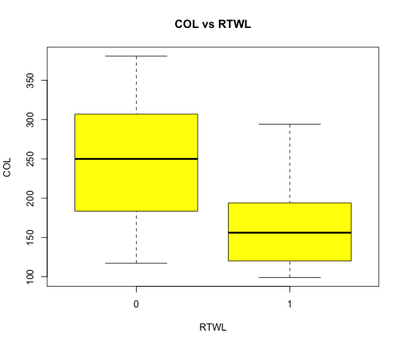
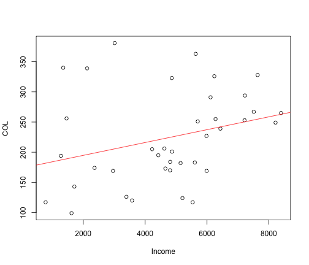

Psych 252: R Tutorial Module 3
========================================================

Based on notes by Paul Thibodeau (2009) and revisions by the Psych 252 instructors in 2010 and 2011

Expanded in 2012 by Mike Frank, Benoit Monin and Ewart Thomas

Converted to [R Markdown](http://www.rstudio.com/ide/docs/r_markdown) format and further expanded in 2013 by Stephanie Gagnon.

2013 TAs: Stephanie Gagnon, Lauren Howe, Michael Waskom, Alyssa Fu, Kevin Mickey, Eric Miller


Performing t-tests in R
-----------------------

The *t-test* allow us to test a **null hypothesis ($H_0$)** about population means. For instance, if we are interested in whether two populations are different, we can test the $H_0$ that the mean of population 1 is equal to the mean of population 2.

As an example, we'll return to some data from Tutorial 2. This data has information about whether or not cities have right to work laws (RTWL), and their cost of living (COL). Here, we might be interested in whether the right to work law has an influence on cost of living. In this case, our null hypothesis ($H_0$) is that the mean COL is the same in cities with RTWL = 0 as in those with RTWL = 1.

In this case, it is important to note that the 2 populations of cities are *independent* of each other. That is, the cities with no RTWL are different from the cities that have a RTWL.

To test our $H_0$, we'll compute a "standardized difference", or **t statistic**, between the *sample mean* COL of the cities with RTWL=0 and the sample mean COL of the cities with RTWL=1. Once we compute this t, we can decide if it's "large" (e.g., -2 > t > 2) to determine if we can reject our $H_0$. For now, you don't have to worry much about these details; we'll cover them in the first few classes!

### Exploring the data

Let's start by reading in our data:


```r
d0 = read.csv("http://www.ilr.cornell.edu/~hadi/RABE4/Data4/P005.txt", sep = "\t")
str(d0)
```

```
## 'data.frame':	38 obs. of  8 variables:
##  $ City  : Factor w/ 38 levels "Atlanta","Austin",..: 1 2 3 4 5 6 7 9 8 10 ...
##  $ COL   : int  169 143 339 173 99 363 253 117 294 291 ...
##  $ PD    : int  414 239 43 951 255 1257 834 162 229 1886 ...
##  $ URate : num  13.6 11 23.7 21 16 24.4 39.2 31.5 18.2 31.5 ...
##  $ Pop   : int  1790128 396891 349874 2147850 411725 3914071 1326848 162304 164145 7015251 ...
##  $ Taxes : int  5128 4303 4166 5001 3965 4928 4471 4813 4839 5408 ...
##  $ Income: int  2961 1711 2122 4654 1620 5634 7213 5535 7224 6113 ...
##  $ RTWL  : int  1 1 0 0 1 0 0 0 1 0 ...
```

```r
head(d0)
```

```
##          City COL   PD URate     Pop Taxes Income RTWL
## 1     Atlanta 169  414  13.6 1790128  5128   2961    1
## 2      Austin 143  239  11.0  396891  4303   1711    1
## 3 Bakersfield 339   43  23.7  349874  4166   2122    0
## 4   Baltimore 173  951  21.0 2147850  5001   4654    0
## 5 Baton Rouge  99  255  16.0  411725  3965   1620    1
## 6      Boston 363 1257  24.4 3914071  4928   5634    0
```


Now we'll plot the data to see the relationship between RTWL and COL:


```r
boxplot(COL ~ RTWL, col = "yellow", pch = 23, xlab = "RTWL", ylab = "COL", main = "COL vs RTWL", 
    data = d0)
```

 


### Short-form data for t.test()

Before we can run a t-test, we have to make some changes to the data. From looking at the data above, we can see that the dataframe d0 is in *long-form*; each variable is in a different column. This format is fine for `boxplot()` and `lm()`, but older functions like `t.test()` need the data in *short-form* with COL for cities with RTWL = 0 in one column, and COL for cities with RTWL = 1 in a 2nd column.

We'll make 2 variables by selecting **subsets** of the COL data, *conditional* on whether or not the cities have a RTWL. In R, the *brackets* (`[ ]`) let us select rows of a variable conditional on another variable. Here, we'll select the rows of COL where RTWL is equal to 0, or 1:


```r
COL0 = d0$COL[d0$RTWL == 0]
COL1 = d0$COL[d0$RTWL == 1]
```


Now that the COL data is grouped into variables based on RTWL status, we can explore these variables quickly:


```r
str(COL0)
```

```
##  int [1:28] 339 173 363 253 117 291 170 239 183 227 ...
```

```r
str(COL1)
```

```
##  int [1:10] 169 143 99 294 174 194 120 117 206 126
```


Here, we see that there are 28 cities with RTWL=0, and 10 cities with RTWL=1.

### Running an Independent Samples t-test

Now that we have our data in the correct format, we can run a t-test testing the H0 that mean(COL0) = mean(COL1). Right now, we'll just assume that the two variances are equal.


```r
res1 = t.test(COL0, COL1, var.equal = TRUE)
res1
```

```
## 
## 	Two Sample t-test
## 
## data:  COL0 and COL1
## t = 3.199, df = 36, p-value = 0.002875
## alternative hypothesis: true difference in means is not equal to 0
## 95 percent confidence interval:
##   29.52 131.79
## sample estimates:
## mean of x mean of y 
##     244.9     164.2
```


### Testing for equal variance

Great! However, we automatically assumed that the variances were equal between the 2 groups of cities. We can use the **standard deviation** function `sd()` to approximate the variance for these 2 groups:


```r
c(sd0 = sd(COL0), sd1 = sd(COL1))
```

```
##   sd0   sd1 
## 71.67 57.68
```


These numbers are pretty different; however, the two groups had different numbers of cities. We can use the `var.test()` function to directly test the H0 that the variance between two samples is equal.


```r
var.test(COL0, COL1)
```

```
## 
## 	F test to compare two variances
## 
## data:  COL0 and COL1
## F = 1.544, num df = 27, denom df = 9, p-value = 0.5063
## alternative hypothesis: true ratio of variances is not equal to 1
## 95 percent confidence interval:
##  0.4307 4.0618
## sample estimates:
## ratio of variances 
##              1.544
```


Here, we cannot reject the null because the two variances are not significantly different from eachother (*p* = 0.5063).

### Running a Paired t-test

Suppose the COL measurements for RTWL=0 and RTWL=0 had been taken from the *same* cities. That is, the COL when RTWL=0 is from *before* the law was passed; the COL when RTWL=1 is from *after* the law was passed. Now, the samples would NOT be independent. Instead, the COL when RTWL=1 in city A is *dependent* on COL when RTWL=0. In this case, the two samples are *paired*. **Is COL influenced by RTWL?**

As an example, we have a study in which, for each city, COL is measured BEFORE the RTWL is passed, and 2 years AFTER the RTWL is passed:


```r
d0s = read.csv("rtwl.paired.csv")
str(d0s)
```

```
## 'data.frame':	14 obs. of  2 variables:
##  $ col0: int  213 267 252 166 370 92 294 46 213 155 ...
##  $ col1: int  135 160 118 94 250 175 206 93 214 203 ...
```


Since the two groups are **paired** (i.e., NOT independent), we must specify that in the `t.test()` by saying "`paired=TRUE`". Otherwise, our results will be incorrect.


```r
res2a = t.test(d0s$col0, d0s$col1, var.equal = TRUE, paired = TRUE)
res2a
```

```
## 
## 	Paired t-test
## 
## data:  d0s$col0 and d0s$col1
## t = 3.065, df = 13, p-value = 0.009039
## alternative hypothesis: true difference in means is not equal to 0
## 95 percent confidence interval:
##   17.5 101.1
## sample estimates:
## mean of the differences 
##                   59.29
```


If we made a mistake and forgot to specify "`paired=TRUE`", R would default to `paired=FALSE`, and our output would be incorrect:


```r
res2b = t.test(d0s$col0, d0s$col1, var.equal = TRUE)
res2b
```

```
## 
## 	Two Sample t-test
## 
## data:  d0s$col0 and d0s$col1
## t = 1.964, df = 26, p-value = 0.06031
## alternative hypothesis: true difference in means is not equal to 0
## 95 percent confidence interval:
##   -2.765 121.336
## sample estimates:
## mean of x mean of y 
##     226.2     166.9
```


Here, the difference is not quite significant! So it's important you tell R that the groups are paired when the two samples are dependent on one another!

### Generate boxplots from short-form data

Now let's take a quick peek at this data. Since d0s is in short-form, we need to make some changes before boxplot can generate a plot for us. We'll start by making a variable by combining the data in the variable d0s$col0 with the data in d0s$col1:


```r
col = c(d0s$col0, d0s$col1)
col
```

```
##  [1] 213 267 252 166 370  92 294  46 213 155 228 213 384 274 135 160 118
## [18]  94 250 175 206  93 214 203 135  84 298 172
```


Then, we'll use the `rep()` (short for "repeat") function to make a long vector of 0s and 1s signifying RTWL status. Each vector should be 14 numbers long, since there were 14 cities total:


```r
rtwl = rep(c(0, 1), each = 14)
rtwl
```

```
##  [1] 0 0 0 0 0 0 0 0 0 0 0 0 0 0 1 1 1 1 1 1 1 1 1 1 1 1 1 1
```


Now, we'll combine these variables to make a dataframe; there will be 2 variables, *(1)* the cost of living for the 14 cities before & after the RTWL was passed, and *(2)* the status of the RTWL:


```r
d0l = data.frame(cbind(col = col, rtwl = rtwl))
d0l
```

```
##    col rtwl
## 1  213    0
## 2  267    0
## 3  252    0
## 4  166    0
## 5  370    0
## 6   92    0
## 7  294    0
## 8   46    0
## 9  213    0
## 10 155    0
## 11 228    0
## 12 213    0
## 13 384    0
## 14 274    0
## 15 135    1
## 16 160    1
## 17 118    1
## 18  94    1
## 19 250    1
## 20 175    1
## 21 206    1
## 22  93    1
## 23 214    1
## 24 203    1
## 25 135    1
## 26  84    1
## 27 298    1
## 28 172    1
```


Finally,  we can create a boxplot:


```r
boxplot(col ~ rtwl, col = "lightgreen", pch = 23, xlab = "RTWL", ylab = "COL", 
    main = "COL vs RTWL, paired data", data = d0l)
```

 


Additive & Interactive Models
-----------------------------------

Returning to the initial data, d0, we saw that COL depends on RTWL. Does it also depend on Income? To get a general idea, we can look at the data by plotting income and COL, as well as the linear line of best fit in red:


```r
plot(COL ~ Income, data = d0)
abline(lm(COL ~ Income, data = d0), col = "red")
```

 


Now, we might be interested in the how the effect of RTWL on COL is related to Income level. In an **additive model** (e.g., `COL ~ RTWL + Income`), the effect of RTWL on COL is assumed to be the same at all levels of Income. Here, if income level were tightly correlated with whether or not cities have a RTWL, the unique variance explained by RTWL and Income level might be small. 

In contrast, in an **interactive model** (e.g., `COL ~ RTWL * Income`) the effect of RTWL on COL is **NOT** assumed to be the same at all levels of Income. Here, the RTWL could be positively correlated with COL at low incomes, but negatively correlated at high incomes.

### Treating income as a categorical variable

For simplicity, we might want to look at income as a categorical **factor**, not a quantitative variable. So let us replace Income by a new factor, "Incomecat" which can be 'low' or 'high'. We'll use an income of 4000 as the dividing point; those cities with incomes less than 4000 will fall into the "low" income category, and those with incomes at 4000 or above will fall into the "high" income category:


```r
d0$Incomecat = findInterval(d0$Income, 4000)
d0$Incomecat = factor(d0$Incomecat, labels = c("low", "high"))
```


Now we'll print a *cross-tabulation* of RTWL and Incomecat to get an idea of how many cities fall into each group:


```r
table(d0$Incomecat, d0$RTWL)
```

```
##       
##         0  1
##   low   4  8
##   high 24  2
```


Note that there are only 2 cities with RTWL = 1 and Incomecat = high....so the following results are suspect. We'll continue though, just to demonstrate how to conduct these models.

### Additive model


```r
res3 = lm(COL ~ RTWL + Incomecat, data = d0)
summary(res3)
```

```
## 
## Call:
## lm(formula = COL ~ RTWL + Incomecat, data = d0)
## 
## Residuals:
##     Min      1Q  Median      3Q     Max 
## -123.17  -53.01   -1.47   44.83  156.05 
## 
## Coefficients:
##               Estimate Std. Error t value Pr(>|t|)    
## (Intercept)      273.0       29.1    9.37  4.5e-11 ***
## RTWL            -102.2       32.1   -3.18   0.0031 ** 
## Incomecathigh    -32.8       30.5   -1.08   0.2887    
## ---
## Signif. codes:  0 '***' 0.001 '**' 0.01 '*' 0.05 '.' 0.1 ' ' 1
## 
## Residual standard error: 68.3 on 35 degrees of freedom
## Multiple R-squared:  0.246,	Adjusted R-squared:  0.203 
## F-statistic: 5.72 on 2 and 35 DF,  p-value: 0.00709
```


### Interactive model


```r
res4 = lm(COL ~ RTWL * Incomecat, data = d0)
summary(res4)
```

```
## 
## Call:
## lm(formula = COL ~ RTWL * Incomecat, data = d0)
## 
## Residuals:
##     Min      1Q  Median      3Q     Max 
## -113.83  -43.94    4.21   33.44  132.17 
## 
## Coefficients:
##                    Estimate Std. Error t value Pr(>|t|)    
## (Intercept)           329.0       29.4   11.21  5.8e-13 ***
## RTWL                 -186.2       36.0   -5.18  1.0e-05 ***
## Incomecathigh         -98.2       31.7   -3.10  0.00391 ** 
## RTWL:Incomecathigh    205.4       56.2    3.65  0.00086 ***
## ---
## Signif. codes:  0 '***' 0.001 '**' 0.01 '*' 0.05 '.' 0.1 ' ' 1
## 
## Residual standard error: 58.7 on 34 degrees of freedom
## Multiple R-squared:  0.459,	Adjusted R-squared:  0.411 
## F-statistic: 9.61 on 3 and 34 DF,  p-value: 9.72e-05
```


Here we can see that the interaction is significant. To get a better idea for the data, we can use the `interaction.plot()` function to plot COL by RTWL and Income category:


```r
with(d0, interaction.plot(RTWL, Incomecat, COL, fun = mean, xlab = "RTWL", ylab = "COL", 
    lwd = 2))
```

 


By looking at this plot, we can see that when the income is high, the effect of RTWL on COL is small. However, when income is low, cost of living is lower if there is a right to work law.


Exploring Repeated Measures Exercise Data
-----------------------------------------

Here, we'll start by loading in the packages we introduced in lecture 2:


```r
library(ggplot2)
library(reshape2)
```


### Running a source file

Next, we're going to run a source file `mc.plots1.r` to change around some plotting parameters, including loading in the 'grid' package. Calling `source()` runs all the code in the .R file.


```r
source("mc.plots1.r")
```

```
## 'opts' is deprecated. Use 'theme' instead. (Deprecated; last used in
## version 0.9.1) 'theme_blank' is deprecated. Use 'element_blank' instead.
## (Deprecated; last used in version 0.9.1) 'theme_blank' is deprecated. Use
## 'element_blank' instead. (Deprecated; last used in version 0.9.1)
## theme_segment is deprecated. Use 'element_line' instead. (Deprecated; last
## used in version 0.9.1) theme_segment is deprecated. Use 'element_line'
## instead. (Deprecated; last used in version 0.9.1) theme_text is
## deprecated. Use 'element_text' instead. (Deprecated; last used in version
## 0.9.1) theme_text is deprecated. Use 'element_text' instead. (Deprecated;
## last used in version 0.9.1)
```


### Exercise data

Now, we'll load in the data file `exer.csv`. Here, participants (*n* = 30) were randomly assigned to two different diets: low-fat (`diet` = 1) and not low-fat (`diet` = 2), and three different types of exercise: at rest (`exertype` = 1), walking leisurely (`exertype` = 2), and running (`exertype` = 3).  Their pulse rate (`pulse`) was measured at three different time points during their assigned exercise: at 1 minute (`time` = 1), 15 minutes (`time` = 2), and 30 minutes (`time` = 3).  This is a *repeated measures* design, with `time` as the *within-subject* (repeated) variable.  **How does pulse depend on time, diet and exertype?**


```r
d2 <- read.csv("exer.csv")
str(d2)
```

```
## 'data.frame':	90 obs. of  5 variables:
##  $ id      : int  1 1 1 2 2 2 3 3 3 4 ...
##  $ diet    : int  1 1 1 1 1 1 1 1 1 1 ...
##  $ exertype: int  1 1 1 1 1 1 1 1 1 1 ...
##  $ pulse   : int  85 85 88 90 92 93 97 97 94 80 ...
##  $ time    : int  1 2 3 1 2 3 1 2 3 1 ...
```

```r
summary(d2)
```

```
##        id            diet        exertype     pulse            time  
##  Min.   : 1.0   Min.   :1.0   Min.   :1   Min.   : 80.0   Min.   :1  
##  1st Qu.: 8.0   1st Qu.:1.0   1st Qu.:1   1st Qu.: 90.2   1st Qu.:1  
##  Median :15.5   Median :1.5   Median :2   Median : 96.0   Median :2  
##  Mean   :15.5   Mean   :1.5   Mean   :2   Mean   : 99.7   Mean   :2  
##  3rd Qu.:23.0   3rd Qu.:2.0   3rd Qu.:3   3rd Qu.:103.0   3rd Qu.:3  
##  Max.   :30.0   Max.   :2.0   Max.   :3   Max.   :150.0   Max.   :3
```


We can see that all the variables are integers since the raw data entries began with numbers, even though some should be factors. We want to convert `id`, `diet`, and `exertype` to factors with informative levels:


```r
d2$diet <- factor(d2$diet, labels = c("lo.fat", "non.lo.fat"))
d2$id <- factor(d2$id)
d2$exertype <- factor(d2$exertype, labels = c("rest", "walk", "run"))

summary(d2)  # double check formatting
```

```
##        id             diet    exertype      pulse            time  
##  1      : 3   lo.fat    :45   rest:30   Min.   : 80.0   Min.   :1  
##  2      : 3   non.lo.fat:45   walk:30   1st Qu.: 90.2   1st Qu.:1  
##  3      : 3                   run :30   Median : 96.0   Median :2  
##  4      : 3                             Mean   : 99.7   Mean   :2  
##  5      : 3                             3rd Qu.:103.0   3rd Qu.:3  
##  6      : 3                             Max.   :150.0   Max.   :3  
##  (Other):72
```


### Plot exercise data
Now, we'll use `ggplot2`'s `qplot()` function to plot the subjects' pulse over time points 1-3 for each of the 6 groups (diet type X exercise type):


```r
qp3 = qplot(time, pulse, facets = diet ~ exertype, colour = id, geom = "line", 
    data = d2) + theme_bw() + plot.style
print(qp3)
```

 


### Bar graphs

We might also want to visualize this data in bar graph form. To do this with ggplot, we'll use the `aggregate()` function to get means and standard errors from the data.

First, we'll extract the mean pulses across subjects for each of the 6 groups at all three time points:


```r
ms <- aggregate(pulse ~ time + diet + exertype, d2, mean)
ms
```

```
##    time       diet exertype pulse
## 1     1     lo.fat     rest  88.6
## 2     2     lo.fat     rest  89.6
## 3     3     lo.fat     rest  89.8
## 4     1 non.lo.fat     rest  91.8
## 5     2 non.lo.fat     rest  92.2
## 6     3 non.lo.fat     rest  93.0
## 7     1     lo.fat     walk  90.6
## 8     2     lo.fat     walk  94.6
## 9     3     lo.fat     walk  95.2
## 10    1 non.lo.fat     walk  95.6
## 11    2 non.lo.fat     walk  98.6
## 12    3 non.lo.fat     walk  96.6
## 13    1     lo.fat      run  94.0
## 14    2     lo.fat      run 109.8
## 15    3     lo.fat      run 111.4
## 16    1 non.lo.fat      run  98.2
## 17    2 non.lo.fat      run 124.4
## 18    3 non.lo.fat      run 140.6
```


Now, we'll get the standard error of the mean. We'll do this using the function `se.mean()` defined in the script 'mc.plots1.r'. The function is elaborated below:


```r
ms$err = aggregate(pulse ~ time + diet + exertype, d2, FUN = se.mean)$pulse

# This is the same as the function se.mean()
ms$err = aggregate(pulse ~ time + diet + exertype, d2, function(x) {
    sd(x)/sqrt(length(x))
})$pulse

ms
```

```
##    time       diet exertype pulse   err
## 1     1     lo.fat     rest  88.6 2.874
## 2     2     lo.fat     rest  89.6 2.694
## 3     3     lo.fat     rest  89.8 1.985
## 4     1 non.lo.fat     rest  91.8 3.121
## 5     2 non.lo.fat     rest  92.2 2.956
## 6     3 non.lo.fat     rest  93.0 2.757
## 7     1     lo.fat     walk  90.6 1.568
## 8     2     lo.fat     walk  94.6 2.786
## 9     3     lo.fat     walk  95.2 3.397
## 10    1 non.lo.fat     walk  95.6 3.501
## 11    2 non.lo.fat     walk  98.6 3.894
## 12    3 non.lo.fat     walk  96.6 2.943
## 13    1     lo.fat      run  94.0 2.025
## 14    2     lo.fat      run 109.8 5.869
## 15    3     lo.fat      run 111.4 3.544
## 16    1 non.lo.fat      run  98.2 1.655
## 17    2 non.lo.fat      run 124.4 3.855
## 18    3 non.lo.fat      run 140.6 3.219
```


Finally, we plot the bar graph:

```r
qp4 <- qplot(time, pulse, facets = . ~ diet, ymin = pulse - err, ymax = pulse + 
    err, geom = c("pointrange", "line"), colour = exertype, data = ms) + theme_bw() + 
    plot.style
print(qp4)
```

 

