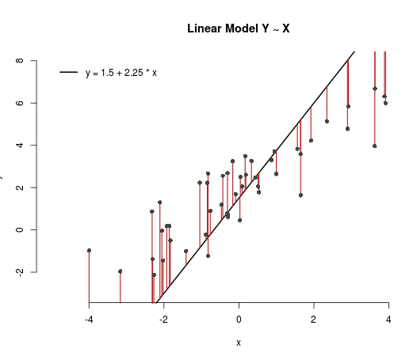
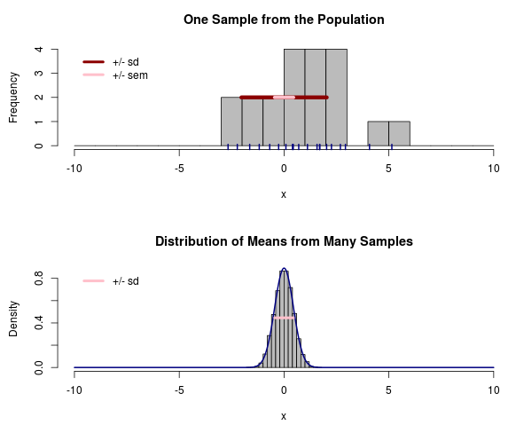
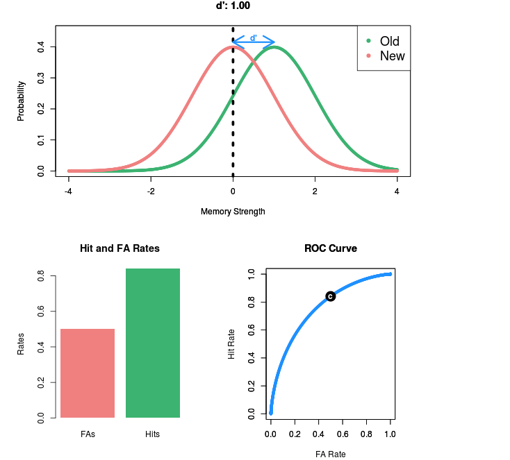

Statistical Methods for Behavioral and Social Sciences
======================================================

Instructors:	  	  
~~~~~~~~~~~~

Ewart Thomas, Benoît Monin

2014 Teaching Assistants:
~~~~~~~~~~~~~~~~~~~~

Rebecca Carey, Caitie Handron, Kara Weisman

Contents
--------

.. toctree::
   :maxdepth: 1

   data/index.rst
   slides/index.rst
   plots/index.rst
   apps/index.rst
   tutorials/index.rst
   cheatsheets/index.rst
   section/index.rst
   section_2013/index.rst
   
