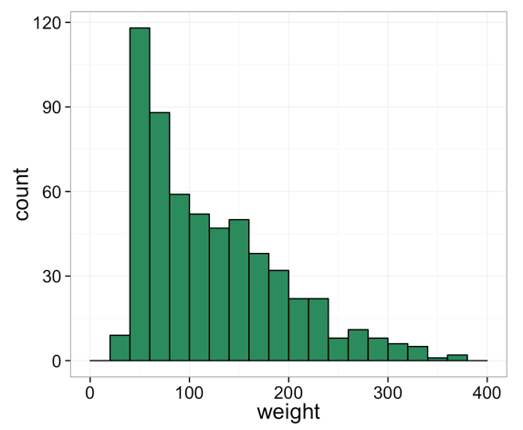
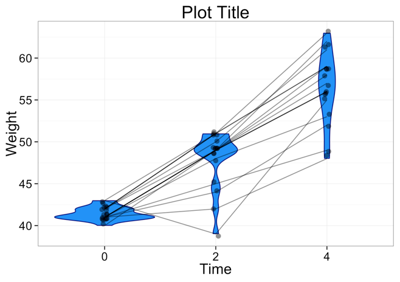
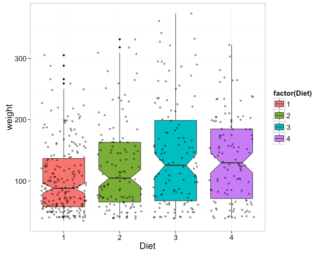
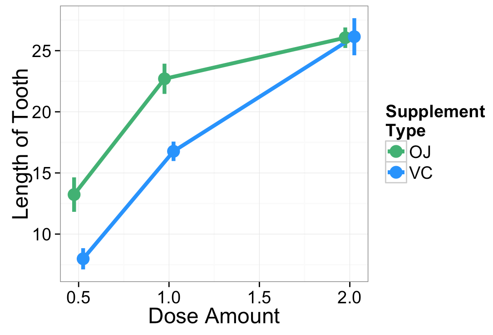
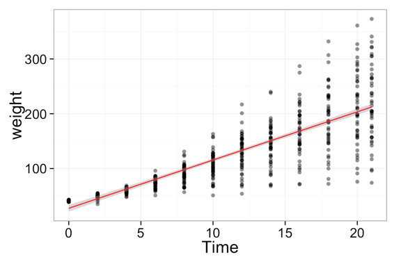
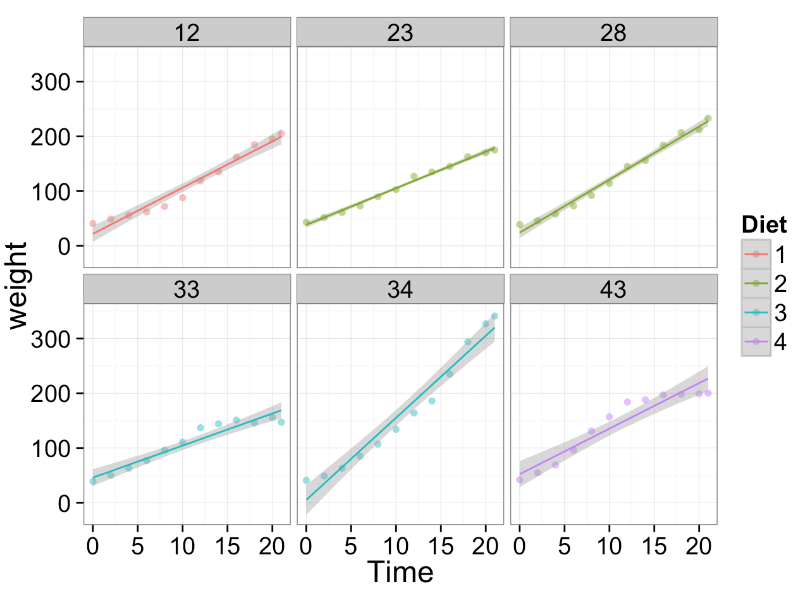

Plotting Examples
================

This is a collection of code you can borrow to make various kinds of plots using packages like ``ggplot``.

Distributions of data
--------------------------

Histograms
~~~~~~~~~~~
[`html <http://www.stanford.edu/class/psych252/plots/histogram_plot.html>`_]
[`Rmd <http://www.stanford.edu/class/psych252/plots/histogram_plot.Rmd>`_]

Violin Plots
~~~~~~~~~~~
[`html <http://www.stanford.edu/class/psych252/plots/violin_plot.html>`_]
[`Rmd <http://www.stanford.edu/class/psych252/plots/violin_plot.Rmd>`_]

Box Plots
~~~~~~~~~~~
[`html <http://www.stanford.edu/class/psych252/plots/boxplot_plot.html>`_]
[`Rmd <http://www.stanford.edu/class/psych252/plots/boxplot_plot.Rmd>`_]

Point plots
~~~~~~~~~~~
[`html <http://www.stanford.edu/class/psych252/plots/point_plot.html>`_]
[`Rmd <http://www.stanford.edu/class/psych252/plots/point_plot.Rmd>`_]

Linear models
--------------------------

Scatter Plots
~~~~~~~~~~~
[`html <http://www.stanford.edu/class/psych252/plots/scatter_plot.html>`_]
[`Rmd <http://www.stanford.edu/class/psych252/plots/scatter_plot.Rmd>`_]

.. image:: images/scatter.png
   :width: 50%
   :alt: alternate text
   :target: http://www.stanford.edu/class/psych252/plots/scatter_plot.html

Linear Regression
~~~~~~~~~~~
[`html <http://www.stanford.edu/class/psych252/plots/linreg_plot.html>`_]
[`Rmd <http://www.stanford.edu/class/psych252/plots/linreg_plot.Rmd>`_]

Plotting by Facets
~~~~~~~~~~~
[`html <http://www.stanford.edu/class/psych252/plots/facet_plot.html>`_]
[`Rmd <http://www.stanford.edu/class/psych252/plots/facet_plot.Rmd>`_]

